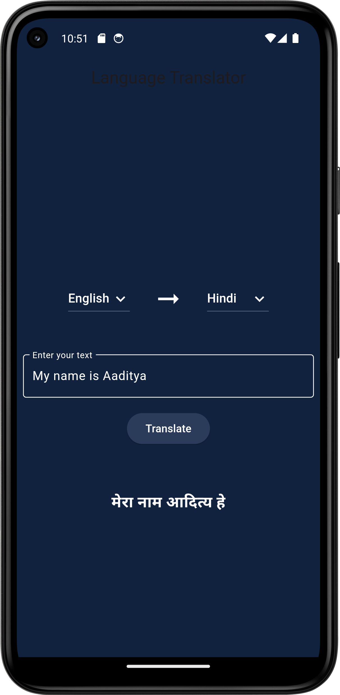

# Language Translator Flutter Project

## Overview

The **Language Translator** is a Flutter application designed to translate text from one language to another. The project uses the `translator` package to handle the translation process, allowing users to select source and destination languages from a predefined list.

## Features

- **Language Selection**: Users can choose from a list of languages, including Hindi, English, Marathi, Bengali, and Punjabi.
- **Text Input**: A text field is provided for users to enter the text they wish to translate.
- **Translation**: Upon clicking the "Translate" button, the app translates the input text from the source language to the destination language and displays the translated text.

## Getting Started

### Prerequisites

- Flutter SDK
- Dart

### Installation

1. **Clone the repository**:

   ```bash
   git clone <repository_url>
   cd language_translator
   ```

2. **Install dependencies**:

   ```bash
   flutter pub get
   ```

3. **Run the application**:

   ```bash
   flutter run
   ```

## Project Structure

- **`lib/main.dart`**: Contains the main widget of the application.
- **`pubspec.yaml`**: Specifies dependencies and other configurations for the project.

## Dependencies

- **Flutter SDK**
- **translator: ^1.0.0** - A Dart package that provides easy language translation functionality.
- **cupertino_icons: ^1.0.6** - Cupertino icons for iOS-style icons.

## Usage

1. **Select Languages**: Use the dropdown menus to select the source and destination languages.
2. **Enter Text**: Input the text you want to translate into the provided text field.
3. **Translate**: Click the "Translate" button to view the translated text.

## Screenshot

<div style="margin:auto; width: 50%;">
   <table>
    <tr>
      <th>
        Language Translator Display
      </th>
    </tr>
    <tr>
      <td align="center">
        
      </td>
    </tr>
  </table>
</div>

## Future Enhancements

- Add support for more languages.
- Implement speech-to-text and text-to-speech features.
- Enhance the UI for a more polished look and feel.

## Resources

- [Flutter Documentation](https://docs.flutter.dev/)
- [Lab: Write your first Flutter app](https://docs.flutter.dev/get-started/codelab)
- [Cookbook: Useful Flutter samples](https://docs.flutter.dev/cookbook)

## License

This project is licensed under the MIT License.

Happy coding! 😊
